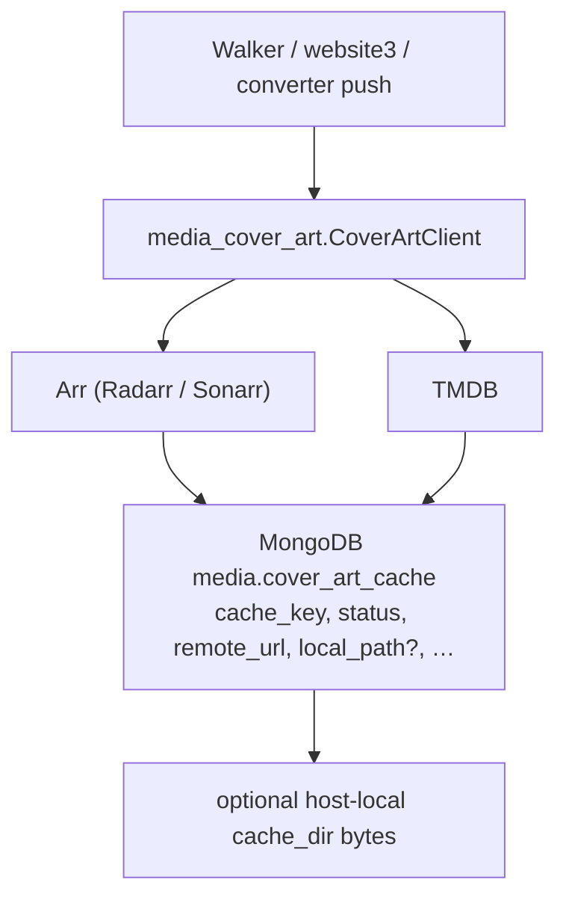
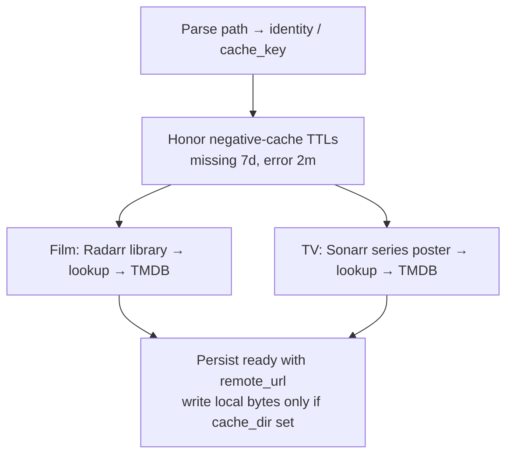
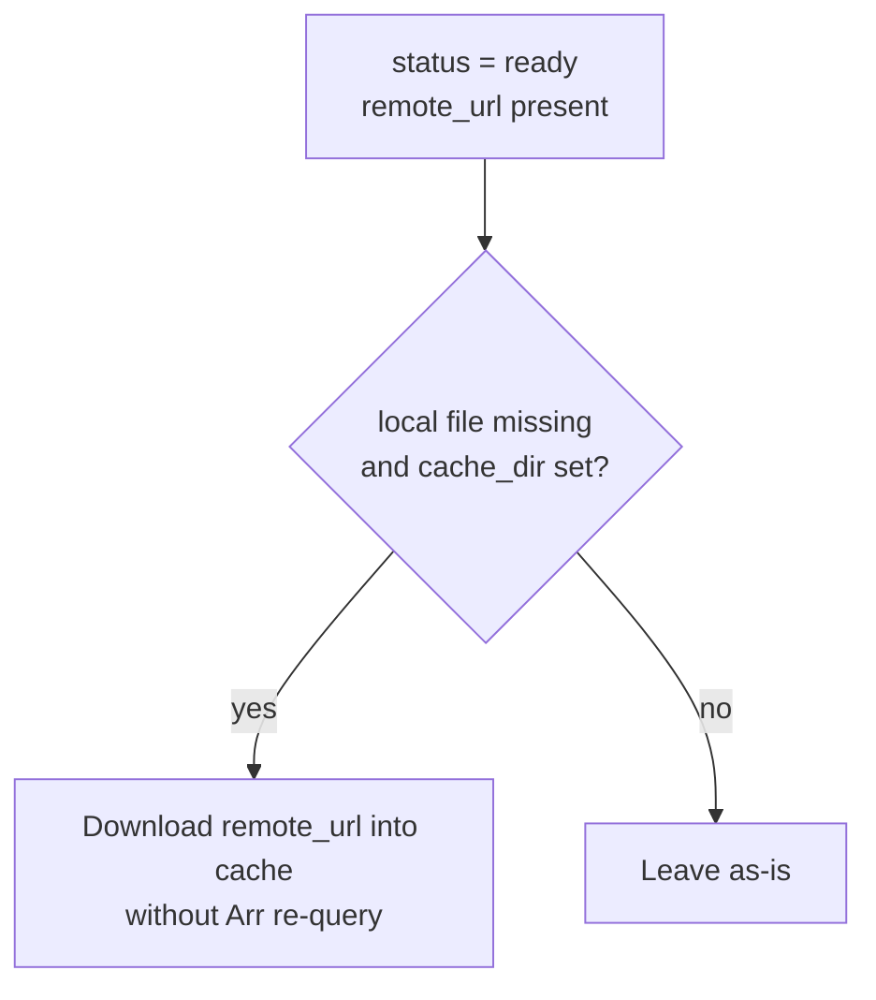

# Architecture

```mermaid
flowchart TD
  hosts["Walker / website3 / converter push"]
  client["media_cover_art.CoverArtClient"]
  arr["Arr (Radarr / Sonarr)"]
  tmdb["TMDB"]
  mongo["MongoDB media.cover_art_cache<br/>cache_key, status, remote_url, local_path?, …"]
  disk["optional host-local cache_dir bytes"]

  hosts --> client
  client --> arr
  client --> tmdb
  arr --> mongo
  tmdb --> mongo
  mongo --> disk
```

## Resolve order

```mermaid
flowchart TD
  parse["Parse path → identity / cache_key"]
  ttl["Honor negative-cache TTLs<br/>missing 7d, error 2m"]
  film["Film: Radarr library → lookup → TMDB"]
  tv["TV: Sonarr series poster → lookup → TMDB"]
  persist["Persist ready with remote_url<br/>write local bytes only if cache_dir set"]

  parse --> ttl
  ttl --> film
  ttl --> tv
  film --> persist
  tv --> persist
```

## Hydrate

```mermaid
flowchart TD
  ready["status = ready<br/>remote_url present"]
  gate{"local file missing<br/>and cache_dir set?"}
  download["Download remote_url into cache<br/>without Arr re-query"]
  skip["Leave as-is"]

  ready --> gate
  gate -->|yes| download
  gate -->|no| skip
```
